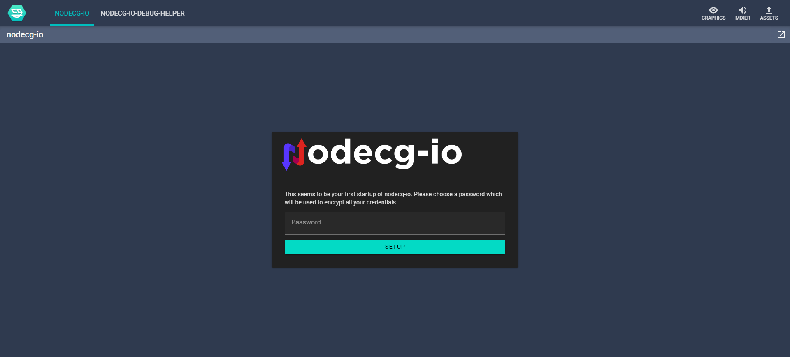

# Try an included sample

Trying one of the premade example bundles is a good way to get to know the
framework and especially the selected service.

!!! ATTENTION

    In case you installed the **production** branch of nodecg-io, you are out of
    luck. Because the build process will cause problems if you just take one of the
    samples and rebuild elsewhere.

If you installed **dev** branch via the `nodecg-io-cli` and did not select the
“use the samples”-option run `nodecg-io install` and select it.

In case you cloned the repository directly from GitHub, everything should be
included. But you may want to pull recent changes and rebuild the project.

## Step 1: Run NodeCG

Now you need to start NodeCG. There are a couple of different ways to do this:

### Using VS Code

If you have nodecg-io open in your VS Code instance, you can launch NodeCG using
the `Run and Debug` Explorer View:

### Using the terminal

You may also launch NodeCG using your terminal with:

<pre><code><b>user@computer:<spanstyle="color:#3daee9">~/nodecg</b>$ npm run start

> nodecg@1.8.1 start
> node index.js

info: [nodecg/lib/server] Starting NodeCG 1.8.1 (Running on Node.js v16.11.1)
info: [nodecg-io-core] Minzig!

// A whole host of logging output

info: [nodecg/lib/server] NodeCG running on http://localhost:9090</code></pre>

Now you can open the NodeCG dashboard (by default) under
<http://localhost:9090>.

## Step 2: Log in to nodecg-io

Now navigate to the `nodecg-io` tab in the NodeCG dashboard.

If you are logging in for the first time you will have to set your password.

Otherwise, you simply have to log in with your previously chosen password.

Now you are looking at the `nodecg-io` dashboard. It should look like this:

These bundles on the right side will only be listed if you have installed the
samples as described at the start of this page.

## Step 3: Learning how to use the GUI

The GUI that you see now is split into multiple sections that are described below.

### In pink: NodeCG Tabs

Here you will find every NodeCG-bundle that has a dashboard. Here you may select
the [nodecg-io-debug](../samples/debug.md)-dashboard, if it is installed.

### In green: Services section

Here on the left side you may create, update and delete instances of a service.
Each instance has its own name and configuration. All existing instances are listed
in this section and can be filtered using the `'Search'` field right below the
section title.

_Creating a new service instance_:

This can be accomplished by clicking the floating action button with the `'+'`
sign in the bottom right of the services section. This will open a dialog where
you can enter the name of the new instance and select its service type. Then click
on `'Create'`. The newly created instance should now open a dialog for configuration
if it needs to be configured.

_Configure a service instance_:

A newly created instance will automatically open its config dialog, or you can
click on an existing instance from the list to open its configuration. A warning
sign next to the instance name shows that the service needs to be configured as seen
on the `'example'` instance in the image above.

This dialog consists of a text editor which provides auto-completion for the
JSON-configuration of the current service instance. After changing the config, you
may save the changes by clicking the `'Save'` button or pressing `Ctrl`+`S`. To
discard the changes, press the `'Cancel'` button or `Esc`.

_Deleting a service instance_:

This can be accomplished by clicking the red button with the delete symbol on an
existing instance. This will open a dialog to confirm the deletion.

### In violet: Bundles section

This section also has a `'Search'` field to filter the existing bundles. Every
entry has the bundle name as its title and a dropdown for each service that it
needs. Using these dropdowns you can select which instance it should use, or you can
unset the dependency by pressing the `'x'` that appears when hovering over the
dropdown.

When all services of a bundle are set, it shows up as active and moves to the start
of the list as shown in the image using the `'github'` bundle as an example.

### Narrow window

On a narrow window, the Services and Bundles section span the full width of the
browser. You can switch between the two sections using the tabs named
`'Services'` and `'Bundles'` just above the title as highlighted in
yellow in the following image.

## Step 4: Configure the sample

The configurations for every sample bundle differ too greatly from each other to
be included here, so you have to take a look at the documentation for your
sample bundle. You will find it on the left-hand side of this page in the
category `Services`.
